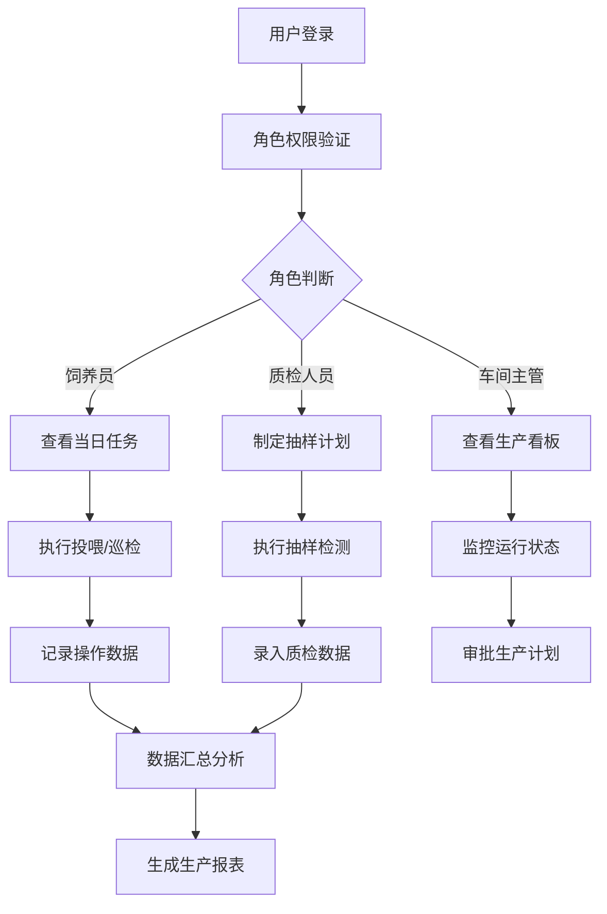
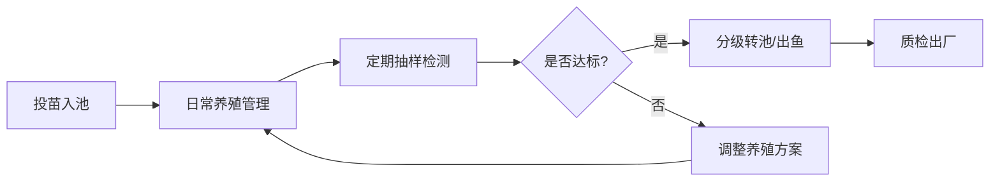

## 1. 产品概述

工厂化循环水养鱼生产管理系统是面向高密度水产养殖车间的智能化管理平台，服务于车间主管、饲养员和质检人员，实现养殖生产全流程数字化管理。

- 核心目标：通过数字化手段提升养殖效率、降低能耗、保障水产品质量安全
- 解决痛点：传统养殖数据记录分散、参数监控不及时、生产流程不规范、质量追溯困难

## 2. 核心功能

### 2.1 用户角色

| 角色 | 注册方式 | 核心权限 |
|------|---------|---------|
| 车间主管 | 系统分配 | 查看所有数据、审批作业计划、人员绩效管理、生产报表导出 |
| 饲养员 | 系统分配 | 执行投喂任务、记录病死鱼、设备巡检、药浴操作、数据填报 |
| 质检人员 | 系统分配 | 鱼体抽样检测、水质检测、质检记录录入、质量追溯 |

### 2.2 功能模块

1. **生产总览**：车间看板、关键指标卡片、实时水质监控、告警信息
2. **池位详情**：养殖池档案、水循环参数、批次信息、实时数据曲线
3. **作业任务**：投喂任务、设备巡检、消毒记录、药浴安排、分级转池、出鱼计划
4. **质量检测**：鱼体抽样、生长曲线、质检记录、病死鱼登记
5. **设备能耗**：能耗统计、氧气管理、设备运行状态
6. **批次追踪**：批次管理、全生命周期追溯
7. **报表中心**：生产日报、人员绩效、统计分析

### 2.3 页面详情

| 页面名称 | 模块名称 | 功能描述 |
|---------|---------|---------|
| 生产总览 | 车间看板 | 展示养殖池状态热力图、产量统计、成活率统计、实时告警 |
| 生产总览 | 关键指标 | 日投喂量、日增重量、水温均值、溶氧均值、pH值、氨氮含量 |
| 生产总览 | 实时监控 | 水循环系统运行状态、氧气供应状态、设备运行状态 |
| 池位详情 | 养殖池档案 | 池号、面积、体积、当前批次、放养密度、投苗日期 |
| 池位详情 | 水循环参数 | 水温、溶氧、pH、氨氮、亚硝酸盐、流速、水位实时曲线 |
| 池位详情 | 批次信息 | 品种、规格、数量、生长阶段、预计出池时间 |
| 作业任务 | 任务列表 | 待办/进行中/已完成任务分类展示，支持任务认领和完成登记 |
| 作业任务 | 投喂管理 | 投喂计划制定、投喂量记录、投喂历史查询 |
| 作业任务 | 设备巡检 | 巡检路线、巡检项、异常上报、维修记录 |
| 质量检测 | 鱼体抽样 | 抽样计划、体重体长测量、生长数据记录 |
| 质量检测 | 生长曲线 | 基于抽样数据生成生长趋势图，与标准曲线对比 |
| 质量检测 | 病死鱼登记 | 死亡数量、死因分析、无害化处理记录 |
| 设备能耗 | 能耗统计 | 日/月用电量、用水量、耗氧量统计与趋势分析 |
| 设备能耗 | 氧气管理 | 溶氧实时监控、供氧设备调度、异常报警 |
| 批次追踪 | 批次管理 | 批次创建、批次转移、批次状态管理 |
| 批次追踪 | 全生命周期 | 从投苗到出池的完整操作记录和数据追溯 |
| 报表中心 | 生产日报 | 每日生产数据汇总、关键指标对比 |
| 报表中心 | 人员绩效 | 饲养员工作量统计、任务完成率、质量指标 |

## 3. 核心流程

### 3.1 日常生产流程

饲养员登录系统后查看当日待办任务，按计划执行投喂、巡检等作业，记录操作数据；质检人员定期进行鱼体抽样和水质检测；车间主管通过看板监控整体生产状态，审批计划并查看报表。

### 3.2 批次生命周期流程

## 4. 用户界面设计

### 4.1 设计风格

- **主色调**：深海蓝 (#0C4A6E) - 代表水和专业
- **辅助色**：青绿色 (#0D9488) - 代表生态和健康
- **强调色**：琥珀色 (#F59E0B) - 用于告警和重要提示
- **中性色**：深灰 (#1E293B)、中灰 (#64748B)、浅灰 (#F1F5F9)
- **按钮风格**：圆角矩形、轻微阴影、悬停有颜色过渡效果
- **字体**：标题使用思源黑体 Bold，正文使用思源黑体 Regular，数据展示使用等宽字体
- **布局风格**：卡片式布局、左侧导航栏、顶部状态栏、内容区域网格化排布
- **图标风格**：线性图标，使用 Lucide 图标库，保持统一的线条粗细

### 4.2 页面设计概述

| 页面名称 | 模块名称 | UI元素 |
|---------|---------|-------|
| 生产总览 | 车间看板 | 网格热力图、数据卡片、状态指示灯、告警列表、滚动数据展示 |
| 生产总览 | 关键指标 | 大数字卡片、趋势小图表、同比环比标识 |
| 池位详情 | 养殖池档案 | 信息卡片、标签、状态徽章、数据表格 |
| 池位详情 | 水循环参数 | 折线图、面积图、实时数据刷新动画 |
| 作业任务 | 任务列表 | 时间线布局、任务卡片、进度条、操作按钮组 |
| 质量检测 | 生长曲线 | 双Y轴折线图、对比区域、数据点标注 |
| 设备能耗 | 能耗统计 | 柱状图、饼图、占比分析、节能提示 |
| 报表中心 | 生产日报 | 表格、导出按钮、日期选择器、图表联动 |

### 4.3 响应式

- 采用桌面优先设计，适配 1920×1080 及以上分辨率
- 侧边栏在平板设备上可折叠收起
- 数据表格在小屏幕上支持横向滚动
- 触控设备优化按钮尺寸和点击区域

### 4.4 交互设计

- 页面切换采用淡入淡出过渡动画
- 数据卡片悬停时有轻微上浮和阴影加深效果
- 图表支持数据点悬停显示详情
- 告警信息有脉冲动画提示
- 表单提交有加载状态和成功/失败反馈
