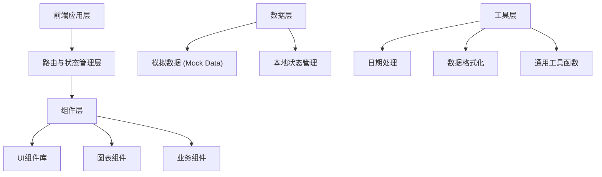
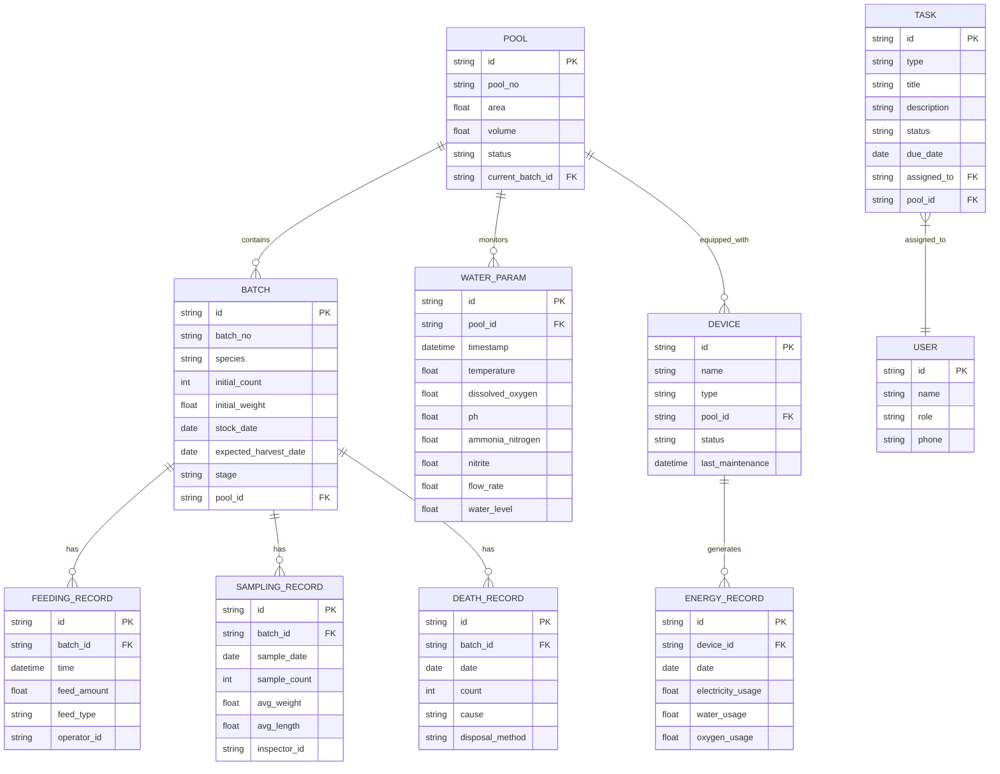

## 1. 架构设计



## 2. 技术描述

- **前端框架**: React@18 + TypeScript
- **构建工具**: Vite@5
- **样式方案**: TailwindCSS@3
- **路由管理**: React Router DOM@6
- **图表库**: Recharts@2
- **图标库**: Lucide React
- **状态管理**: React Hooks (useState, useContext, useReducer)
- **后端**: 无后端，使用模拟数据 (Mock Data)
- **数据库**: 无数据库，使用静态JSON数据

## 3. 路由定义

| 路由路径 | 页面名称 | 说明 |
|---------|---------|------|
| / | 生产总览 | 车间看板、关键指标、告警信息 |
| /pool/:id | 池位详情 | 单个养殖池的详细信息 |
| /pools | 池位列表 | 所有养殖池概览 |
| /tasks | 作业任务 | 任务列表、投喂管理、设备巡检 |
| /quality | 质量检测 | 鱼体抽样、生长曲线、病死鱼登记 |
| /energy | 设备能耗 | 能耗统计、氧气管理、设备状态 |
| /batches | 批次追踪 | 批次管理、全生命周期追溯 |
| /reports | 报表中心 | 生产日报、人员绩效、统计分析 |

## 4. 数据模型

### 4.1 数据模型定义



### 4.2 数据结构定义

```typescript
// 养殖池
interface Pool {
  id: string;
  poolNo: string;
  area: number;
  volume: number;
  status: 'normal' | 'warning' | 'alarm' | 'maintenance';
  currentBatchId?: string;
}

// 批次
interface Batch {
  id: string;
  batchNo: string;
  species: string;
  initialCount: number;
  initialWeight: number;
  stockDate: string;
  expectedHarvestDate: string;
  stage: 'fry' | 'juvenile' | 'adult' | 'ready';
  poolId: string;
}

// 水质参数
interface WaterParam {
  id: string;
  poolId: string;
  timestamp: string;
  temperature: number;
  dissolvedOxygen: number;
  ph: number;
  ammoniaNitrogen: number;
  nitrite: number;
  flowRate: number;
  waterLevel: number;
}

// 投喂记录
interface FeedingRecord {
  id: string;
  batchId: string;
  time: string;
  feedAmount: number;
  feedType: string;
  operatorId: string;
}

// 任务
interface Task {
  id: string;
  type: 'feeding' | 'inspection' | 'disinfection' | 'medicine' | 'transfer' | 'harvest';
  title: string;
  description: string;
  status: 'pending' | 'in_progress' | 'completed' | 'cancelled';
  dueDate: string;
  assignedTo: string;
  poolId?: string;
}

// 抽样记录
interface SamplingRecord {
  id: string;
  batchId: string;
  sampleDate: string;
  sampleCount: number;
  avgWeight: number;
  avgLength: number;
  inspectorId: string;
}

// 设备
interface Device {
  id: string;
  name: string;
  type: 'pump' | 'aerator' | 'filter' | 'heater' | 'sensor';
  poolId?: string;
  status: 'running' | 'stopped' | 'fault' | 'maintenance';
  lastMaintenance: string;
}

// 能耗记录
interface EnergyRecord {
  id: string;
  date: string;
  electricityUsage: number;
  waterUsage: number;
  oxygenUsage: number;
  poolId?: string;
}

// 用户
interface User {
  id: string;
  name: string;
  role: 'supervisor' | 'feeder' | 'inspector';
  phone: string;
}
```

## 5. 项目目录结构

```
e:\trae-bz\TraeProjects\1021
├── src/
│   ├── components/          # 通用组件
│   │   ├── Layout/          # 布局组件
│   │   ├── Card/            # 卡片组件
│   │   ├── Chart/           # 图表组件
│   │   ├── Table/           # 表格组件
│   │   └── Status/          # 状态指示组件
│   ├── pages/               # 页面组件
│   │   ├── Dashboard/       # 生产总览
│   │   ├── PoolDetail/      # 池位详情
│   │   ├── Tasks/           # 作业任务
│   │   ├── Quality/         # 质量检测
│   │   ├── Energy/          # 设备能耗
│   │   ├── Batches/         # 批次追踪
│   │   └── Reports/         # 报表中心
│   ├── data/                # 模拟数据
│   │   ├── pools.ts
│   │   ├── batches.ts
│   │   ├── waterParams.ts
│   │   ├── tasks.ts
│   │   ├── samplings.ts
│   │   ├── devices.ts
│   │   └── energy.ts
│   ├── types/               # TypeScript类型定义
│   │   └── index.ts
│   ├── utils/               # 工具函数
│   │   ├── format.ts
│   │   └── date.ts
│   ├── App.tsx
│   ├── main.tsx
│   └── index.css
├── public/
├── index.html
├── package.json
├── vite.config.ts
├── tsconfig.json
└── tailwind.config.js
```

## 6. 第三方依赖

| 依赖包名 | 版本 | 用途 |
|---------|------|------|
| react | ^18.2.0 | 前端框架 |
| react-dom | ^18.2.0 | DOM渲染 |
| react-router-dom | ^6.20.0 | 路由管理 |
| recharts | ^2.10.0 | 图表可视化 |
| lucide-react | ^0.290.0 | 图标库 |
| tailwindcss | ^3.3.0 | CSS框架 |
| typescript | ^5.3.0 | 类型系统 |
| vite | ^5.0.0 | 构建工具 |
